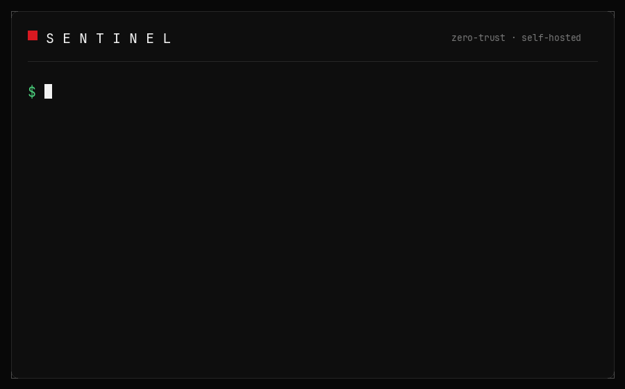

<div align="center">



### Screen time for the whole family — glanceable, honest, and yours.

The open, self-hostable Screen Time. Everyone in the house gets a ring —
kids, teens, and adults tracking only themselves. Set goals and limits, see
the whole family's day at a glance, pause every screen with one tap, and
approve a request from wherever you are. It stays silent unless a human has
to act, and it runs entirely on **your** hardware — no cloud, no accounts,
no telemetry.

[](https://github.com/one-more-refactor/openscreentime/actions/workflows/ci.yml)
&nbsp;[](https://github.com/one-more-refactor/openscreentime/actions/workflows/build.yml)
&nbsp;[](https://github.com/one-more-refactor/openscreentime/releases/latest)
&nbsp;[](https://github.com/one-more-refactor/openscreentime/pkgs/container/openscreentime)


&nbsp;
&nbsp;
&nbsp;
&nbsp;

</div>

---

> ## ⚠️ Alpha — work in progress
>
> OpenScreenTime is early software under active development. It is public so it
> can be read and picked apart, not because it is finished. **Every release is an
> alpha pre-release**, and there is no stable version.
>
> What that means in practice:
>
> - **Breaking changes land without a migration path.** The product was called
>   Sentinel until 0.4.0; upgrading a device enrolled under the old name still
>   leaves things behind — a stale VPN tunnel, a stale `dnsmasq` include that
>   keeps serving the old allowlist, and a recovery account (`sentinel-admin`)
>   that loses its polkit exemption. See [`CHANGELOG.md`](CHANGELOG.md).
> - **Nobody has audited this but its author.** It enforces real limits and
>   tamper lockdowns on real machines; read [`docs/TAMPER.md`](docs/TAMPER.md)
>   before raising the tamper level on a device you actually need.
> - Interfaces, database schema and the agent/server protocol are all still moving.
>
> Run it on hardware you can physically recover, and keep a root shell you trust.

---

## Two commands

Everything below is the whole first run — a server, then a managed device.

```bash
# 1 · stand up the server (writes .env, builds, starts, waits for health)
git clone <this-repo-url> openscreentime && cd openscreentime
deploy/setup.sh --domain ost.example.com

# 2 · on the device you want to manage — the console hands you this line
curl -fsSL https://ost.example.com/install.sh | sudo sh
```

Open `https://ost.example.com`, register yourself with a passkey (registration
locks the moment you do), and the device shows up online within a minute.
That's it. See [`docs/DEPLOY.md`](docs/DEPLOY.md) for the production details.

## What a day with it looks like

**Everything at a glance.** The console opens on the family, not on
infrastructure: one card per person, today's time under their name, and the
one control that outranks them all — **Pause** — freezes every screen in the
house with a single tap, and sweeps visibly across the family when it does.
Everyone also has their own page: one ring, today against their goal, minutes
left in the middle. A nine-year-old's is big and warm; a teen's is quiet with
their own stats; an adult's is a compact private dashboard. The text activity
feed exists, but it is the last resort — if you have to read a log to know how
the day is going, the design has failed.

**Sign in with your device, not your phone.** Passkeys instead of passwords,
and an enrolled computer can vouch for you: open the console on a machine that
knows you and you're already in. The code a parent types to unlock a child's
computer is read live off the console — no authenticator app to install, no QR
to scan, and eight one-time recovery codes as the spare key in the drawer.

**Trust lives at sign-in.** Prove it's you at the door — a passkey, SSO, or
your own computer vouching — and then just use it: pause, grant time, change
rules, no ceremony inside. Only the keys to the household (unlock codes,
recovery codes, passkeys, pairing) ask again, and even that can be one tap on
your paired phone instead of a typed code.

**When it stops, it says so.** Time up is a plain hard stop — "Stop — time's
up for today", a 60-second save-your-work countdown, no euphemism and no
negotiating with a machine. It also can't be gamed: the usage ledger survives
restarts and the day boundary only moves forward, so a reboot or a clock
set-back hands out no free time.

**Fair to both sides.** The kid asks for more time from their own screen; a
parent answers from the console — or right on their phone: pair the Telegram
bot once and the request arrives with ✅/❌ buttons, so "ok to a chore" is one
tap (Discord/Slack webhooks stay send-only). A first-run intro tells
the kid exactly what a parent can and can't see, there is **no remote shell**,
and everything a parent can do goes through the same UI the kid can read about
in [`docs/TRANSPARENCY.md`](docs/TRANSPARENCY.md). What the software can't
do, it says so.

**For any shape of household.** Autonomy scales with age — a curated world
for little kids, requests and earned time for kids, goals plus a wind-down for
teens — and an adult with no kids at all can run it purely for themselves:
fully private self-tracking, no parent, no external enforcement, on their own
server.

## Under the hood

For the person operating it, the same product is a serious enforcement stack:

- **Default-deny on every enrolled device** — DNS and firewall (nftables) allow
  nothing until a policy says so, per Linux user, so a shared family computer
  just works.
- **Anti-cheat on both ends** — the agent *confirms* tampering before it reacts
  (a sustained attack locks the device with an honest "tampering detected"
  screen; a transient blip does not), and the server independently flags a
  client under-reporting its usage.
- **Trust decided at login** — passkey (WebAuthn/FIDO2), optional OIDC SSO, or
  a device voucher from the installed client; rotating session tokens; a
  second factor (code or Telegram tap) guards the sensitive corner — the
  server validates everything; no client is trusted for authorization.
- **One-liner enrollment**, sha256-verified, daily self-updates with a
  kept-`.bak` rollback, and **remote lockdown** that works behind NAT — the
  agent dials out, so nothing is port-forwarded and nothing listens.

## Architecture

```
                 ┌───────────────────────────────┐
                 │   Web console                  │   React + Tailwind (Bun)
                 │   rings · pause · change mode  │   passkey / device sign-in
                 └───────────────┬───────────────┘
                                 │ HTTPS / JSON  (family + admin API)
                 ┌───────────────▼───────────────┐
                 │        Server (Rust)           │   Axum + SQLx + Postgres
                 │  auth · policy engine          │   multi-tenant
                 │  command queue · event log     │   WebSocket agent bus
                 │  anti-cheat · phone alerts     │
                 └───────────────┬───────────────┘
                                 │ HTTPS + WS  (agent API, device-token bearer)
                 ┌───────────────▼───────────────┐
                 │     Linux agent (Rust)         │   static binary, systemd
                 │  default-deny DNS + firewall   │   per-user enforcement
                 │  screen time + usage ledger    │   full-screen hard stop
                 │  tamper resistance             │   transparency tray
                 └────────────────────────────────┘
```

Full technical map (data flows, enforcement model, anti-cheat design, trust
boundaries): **[`docs/ARCHITECTURE.md`](docs/ARCHITECTURE.md)**.

## Monorepo layout

| Path        | What                                                        | Stack                     |
|-------------|-------------------------------------------------------------|---------------------------|
| `server/`   | Backend API, auth, policy engine, agent bus, anti-cheat     | Rust, Axum, SQLx, Postgres|
| `web/`      | The console                                                 | Bun, React, Vite, Tailwind|
| `client/`   | Linux device agent                                          | Rust                      |
| `policy/`   | Shared `Policy` document (used by server **and** client)    | Rust                      |
| `docs/`     | Full documentation — see the [docs index](docs/README.md)   | Markdown                  |

## Documentation

Organized by audience in [`docs/README.md`](docs/README.md):

- **Start here** — [`ARCHITECTURE.md`](docs/ARCHITECTURE.md): how it all fits together.
- **Parents** — [the day-to-day guide](docs/PARENT-GUIDE.md): people, screen time,
  granting time, the unlock code (read off the console), pausing, gone-dark devices.
- **The person being managed** — [`TRANSPARENCY.md`](docs/TRANSPARENCY.md): exactly what
  your parents can and cannot see. (The kid also gets a short version as a first-run
  intro on the device.)
- **Operators** — [deploy](docs/DEPLOY.md), [day-2 operations](docs/OPERATIONS.md), and
  the [agent reference](docs/AGENT.md).
- **Contributors** — [development](docs/DEVELOPMENT.md), [API](docs/API.md),
  [data model](docs/DATA_MODEL.md), [tamper threat model](docs/TAMPER.md).

## Develop it locally

See [`docs/DEVELOPMENT.md`](docs/DEVELOPMENT.md) for the full loop. TL;DR:

```bash
cd server && docker compose up -d db && cargo run   # server + Postgres
cd web && bun install && bun run dev                # the console
cd client && cargo build --release                  # the Linux agent
```

Testing an agent without touching a real host? Run it `--dry-run` (it logs every
enforcement action instead of applying it), or drop it in a throwaway container as
root — see [`docs/DEVELOPMENT.md`](docs/DEVELOPMENT.md).

## Platform support

| Platform | Status                                   |
|----------|------------------------------------------|
| Linux    | ✅ Supported (systemd)                   |
| Windows  | 🕗 Coming soon (Windows service + WFP)   |
| macOS    | 🕗 Coming soon (system extension / MDM)  |
| Android  | 🕗 Coming soon (DeviceOwner + VPN app)   |
| iOS      | 🕗 Coming soon (MDM profile)             |

## Honesty note

On a device where someone has **physical access and root**, shutdown and network
disconnection can never be made *truly* impossible — only expensive and detectable.
OpenScreenTime's tamper resistance is **strong deterrence + real-time alerting** by default,
with an opt-in **maximum-lockdown** mode. It never claims otherwise, and it always
keeps a recovery path. See [`docs/TAMPER.md`](docs/TAMPER.md).

## License

TBD.
