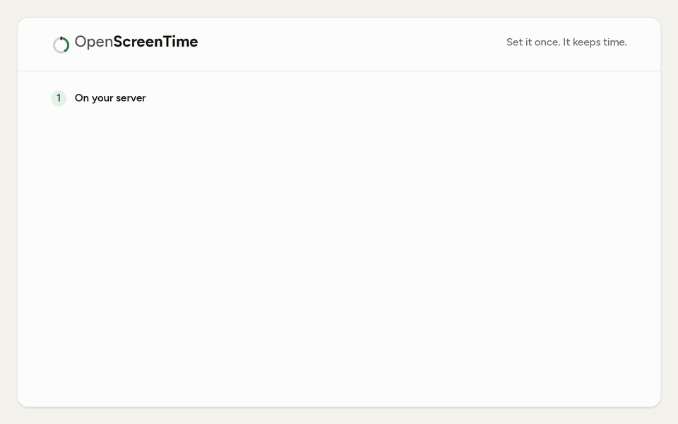

<div align="center">



### Set it once. It keeps time.

OpenScreenTime is the clock on the kitchen wall, not a cop at the door.
Everyone in the house reads the same clock — children, teens, and adults
keeping time for themselves — and it says the time plainly. It runs on
**your** server, and nothing leaves it.

</div>

[](https://github.com/one-more-refactor/openscreentime/actions/workflows/ci.yml)
&nbsp;[](https://github.com/one-more-refactor/openscreentime/actions/workflows/build.yml)
&nbsp;[](https://github.com/one-more-refactor/openscreentime/releases)
&nbsp;
&nbsp;
&nbsp;

---

## One command, then one line per computer

```bash
# on your server — writes .env, starts the stack, backs up, installs boot/backup/update timers
git clone https://github.com/one-more-refactor/openscreentime && cd openscreentime
deploy/setup.sh --domain ost.example.com
```

It prints a one-time setup link. Open it, type your name, make a passkey:
that's your household. Then **Computers → Add a computer** gives you the line
to paste on each Linux computer you look after:

```bash
(wget -qO- https://ost.example.com/install.sh 2>/dev/null || curl -fsSL https://ost.example.com/install.sh || echo exit 1) | sudo OST_TOKEN=<token> sh -s -- --server https://ost.example.com
```

It shows up online within a minute. From then on the server starts at boot,
backs itself up every night and updates itself with a rollback, and the
computers update from your server. Details: [`docs/DEPLOY.md`](docs/DEPLOY.md).

## What it does

**Everything works until you block it.** The internet is open by default.
You block what you choose — a category, an app, a site — and that is blocked
for real, at the computer's resolver and firewall. The youngest start with
adult content, gambling and dating blocked; you can change all of it.

**A day at a glance.** The console opens on the family: one card per person,
a ring that fills with the day's time, and time left. **Pause everything**
stops every screen in the house (press and hold). A request for more time
arrives with its two answers on the card: *Give 15 min* or *Not now*.

**Rules per person, not per machine.** A daily limit is one budget across all
of someone's computers. Set when screens can be on, a bedtime, what's
blocked, and tasks that earn more time. Each login on a shared computer is
its own person.

**When time is up, it says so.** Warnings at 15, 5 and 1 minute. Then the
screen switches to a lock on its own screen — "Time's up for today" — and
the person's apps are paused, never closed. **Ask for more time** is right
there; a parent can type the unlock code at the lock, or answer from the
console, or from their phone (Telegram).

**For yourself, too.** An adult with no children can run it for their own
computer: a daily limit you set, focus hours, sites you block for yourself.
Nobody else sees your apps, your sites or your rules.

**It measures fairly.** Only real use counts — the person at the screen, with
a key, a mouse or sound in the last five minutes; not a locked screen, not a
closed lid. Restarting the agent or turning the clock back gives no free
time.

**Two ways in, no passwords.** Type your name and your own computer shows a
code, or use a passkey. Pausing, giving time and changing rules just work;
only the keys (unlock codes, passkeys) ask you to confirm it's you.

**It tells the person the truth.** What a parent sees depends on age: apps
and sites looked up for younger children, apps only for older teens, only
minutes for adults. It can't see the screen, messages or what anyone types.
There is no remote shell. The full list is in
[`docs/TRANSPARENCY.md`](docs/TRANSPARENCY.md).

## Honest limits

- **Linux only**, for now (systemd, x86_64). Windows, macOS, Android and iOS
  are not built.
- **Someone with root and the machine in their hands wins eventually.**
  OpenScreenTime makes tampering slow and visible, not impossible. See
  [`docs/TAMPER.md`](docs/TAMPER.md).
- **Blocking happens at DNS.** A determined teenager with another way to look
  up names — a hotspot, a VPN you haven't blocked — can get around a block.
- **An offline computer keeps today's rules**, but a pause you send reaches
  it when it's back online.
- **Alpha.** Every release is a pre-release; the database, the API and the
  agent protocol still change. Nobody but its author has audited it. Run it on
  computers you can physically recover. (It was called Sentinel before 0.4;
  see [`CHANGELOG.md`](CHANGELOG.md) for what an old install leaves behind.)

## How it fits together

```
          ┌─────────────────────────────────────┐
          │  Console (web/)                     │  React · Vite · Tailwind
          │  Family · a person · Computers · Me │  passkey or a code on your computer
          └──────────────────┬──────────────────┘
                             │ HTTPS
          ┌──────────────────▼──────────────────┐
          │  Server (server/)                   │  Rust · Axum · Postgres
          │  sign-in · rules · requests · usage │  backs up and updates itself
          └──────────────────┬──────────────────┘
                             │ HTTPS + WebSocket (the agent dials out)
          ┌──────────────────▼──────────────────┐
          │  Agent (client/), on each computer  │  Rust · systemd
          │  counts time · stops · blocks       │  lock on its own screen
          └─────────────────────────────────────┘
       policy/ — the rules document and the one rules function all three share
```

The technical map is [`docs/ARCHITECTURE.md`](docs/ARCHITECTURE.md); every
doc is listed in [`docs/README.md`](docs/README.md).

## Develop

```bash
cd server && docker compose up -d db && cp .env.example .env && cargo run
cd web && bun install && bun run dev          # or VITE_USE_MOCK=1 bun run dev, no backend
cd client && cargo build --release            # run the agent with --dry-run to change nothing
```

[`docs/DEVELOPMENT.md`](docs/DEVELOPMENT.md) has the tests and the container
and VM harnesses for trying the agent safely.

## License

Not chosen yet.
